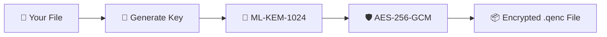

<p align="center">
  
</p>

<p align="center">
  
  
  
  
  
</p>

<p align="center">
  <b>🛡️ Military-Grade Quantum-Resistant File Encryption</b><br/>
  <sub>Protect your files against future quantum computer attacks</sub>
</p>

---

## 🚀 Quick Install (Windows)

**Download and run the installer - no Python required!**

<p align="center">
  <a href="https://github.com/R-A-V-A-N-A/Quantum-File-Encryptor/releases/latest">
    
  </a>
</p>

```
✅ Double-click the installer
✅ Follow the setup wizard
✅ Launch from Start Menu or Desktop
```

---

## ✨ Features

<table>
<tr>
<td width="50%">

### 🔒 **Encryption**
- 🔐 **ML-KEM-1024** post-quantum key encapsulation
- 🛡️ **AES-256-GCM** authenticated encryption
- 🔑 **Argon2id** memory-hard key derivation
- 📁 Single file or batch encryption
- 🗜️ Built-in compression for folders

</td>
<td width="50%">

### 🛡️ **Security**
- 🏛️ **FIPS 203** compliant (August 2024)
- 🏆 **NIST Level 5** - Maximum security
- 🔮 Quantum-attack resistant
- 🕵️ "Harvest Now, Decrypt Later" protection
- ✅ Tamper detection built-in

</td>
</tr>
</table>

---

## 🖥️ Screenshots

```
╔═════════════════════════════════════════════════════════════════╗
║                      QUANTUM FILE ENCRYPTOR                     ║
║━━━━━━━━━━━━━━━━━━━━━━━━━━━━━━━━━━━━━━━━━━━━━━━━━━━━━━━━━━━━━━━━━║
║          Post-Quantum Hybrid Encryption • FIPS 203/204          ║
╠═════════════════════════════════════════════════════════════════╣
║            🔐 ML-KEM-1024 + AES-256-GCM │ NIST Level 5           ║
╚═════════════════════════════════════════════════════════════════╝

  ┌──────────────────────────────────────────────────┐
  │                    MAIN MENU                     │
  ├──────────────────────────────────────────────────┤
  │  [1] 🔐 Encrypt a File                           │
  │  [2] 🔓 Decrypt a File                           │
  │  [3] 📁 Batch Encrypt Multiple Files             │
  │  [4] ℹ  File Info & Verify                       │
  │  [5] 🔄 Check for Updates                        │
  ├──────────────────────────────────────────────────┤
  │  [0] Exit                                        │
  └──────────────────────────────────────────────────┘
```

---

## 📋 How It Works

### Encryption Process


1. **Select** your file or folder
2. **Receive** your unique encryption key (save it!)
3. **Done!** Your file is now quantum-secure

### Decryption Process
1. **Select** the `.qenc` encrypted file
2. **Enter** your encryption key
3. **Done!** Original file restored

---

## 🔧 Installation Options

### Option 1: Windows Installer (Recommended)
```bash
# Download from Releases page
QuantumFileEncryptor_Setup.exe

# Double-click to install
# No dependencies required!
```

### Option 2: Run from Source
```bash
# Clone the repository
git clone https://github.com/R-A-V-A-N-A/Quantum-File-Encryptor.git
cd Quantum-File-Encryptor

# Install dependencies
pip install cryptography argon2-cffi psutil

# Run the application
python encryptor_app.py
```

### Option 3: Command Line
```bash
# Encrypt a file
python cli.py encrypt document.pdf

# Decrypt a file
python cli.py decrypt document.pdf.qenc -p YOUR_KEY
```

---

## 🔐 Security Specifications

| Feature | Specification |
|---------|--------------|
| **Key Encapsulation** | ML-KEM-1024 (FIPS 203) |
| **Symmetric Encryption** | AES-256-GCM |
| **Key Derivation** | Argon2id (64MB, 3 iterations) |
| **Security Level** | NIST Level 5 (256-bit) |
| **Authentication** | AEAD (built-in) |
| **Quantum Resistance** | ✅ Post-quantum secure |

---

## 📊 Why Quantum-Resistant Encryption?

```
⚠️  THREAT: "Harvest Now, Decrypt Later" attacks

Attackers are collecting encrypted data TODAY,
planning to decrypt it when quantum computers exist.

✅  SOLUTION: Post-quantum hybrid encryption

Quantum File Encryptor uses ML-KEM-1024 + AES-256-GCM
to protect your data against BOTH classical AND quantum attacks.
```

---

## 🆕 What's New in v2.1.0

- ✅ **Auto-Update Feature** - Check for updates from within the app
- ✅ **Windows Installer** - Easy one-click installation
- ✅ **Improved UI** - Better file dialogs and Ctrl+C handling
- ✅ **Quantum-Secure Vault** - Full ML-KEM-1024 implementation

---

## 📂 Project Structure

```
QUANTUM_FILE_ENCRYPTOR/
├── encryptor_app.py       # Main application (CLI menu)
├── file_encryptor.py      # Core encryption logic
├── secure_vault_quantum.py # ML-KEM + AES-256-GCM implementation
├── cli.py                 # Command-line interface
├── web_gui.py             # Web-based GUI
├── encryptor_console.py   # Console-only version
└── setup.iss              # Inno Setup installer script
```

---

## 🤝 Contributing

Contributions are welcome! Please feel free to submit a Pull Request.

---

## 📜 License

This project is licensed under the MIT License - see the [LICENSE](LICENSE) file for details.

---

## ⚠️ Disclaimer

This software is provided for educational and legitimate security purposes only. Always keep backups of your important files and **NEVER lose your encryption keys** - encrypted files cannot be recovered without them.

---

<p align="center">
  <b>🔐 Secure Your Files Against the Quantum Future</b><br/>
  <sub>Made with ❤️ by <a href="https://github.com/R-A-V-A-N-A">R-A-V-A-N-A</a></sub>
</p>

<p align="center">
  
</p>
